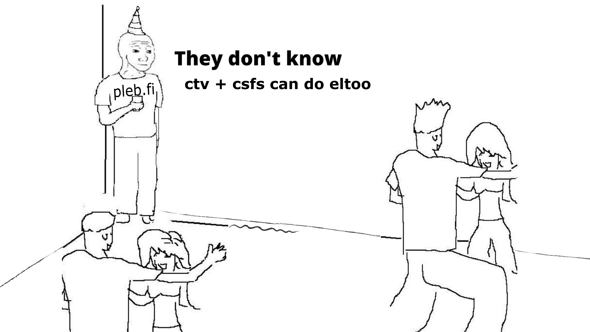

# Simple CTV+CSFS 🥪+🥞=🪄

A very simple example of how you can use OP_CHECKTEMPLATEVERIFY [(BIP-119)][bip119] with OP_CHECKSIGFROMSTACK [(BIP-348)][bip348] to create a transaction that can be pre-signed without committing to a specific input

[bip119]: https://github.com/bitcoin/bips/blob/master/bip-0119.mediawiki
[bip348]: https://github.com/bitcoin/bips/blob/master/bip-0348.md

https://mutinynet.com/tx/a2ae60808d57bbd7fbf73e6a41575d33b1492b73bcd51a59e9cfe457d17dfb57

## raw transaction

02000000000101f688f43aef624b9fee73fa0eec417dd156c0e5d24a8f2d02e11ddc805d2260910100000000fdffffff02391b0000000000001600146a8f30e42f81d23c6e24f34c0ecad822b757e4900000000000000000106a0e6374762b637366733d6d61676963034076411c14bbe3f71d59f80e357b4825251852ecf9b0f621a775e11a537f3cf92fa54a8a40f72632105f11e448eed8dfebf712ecc24d367c052fad9a4b071077b744200f6da9d969996031de44e950469ff68bec08878faef1e9317289505661aa5f85b32099eedb11f699d4408127d928af8fa5b552c309a708559b956775fd7db4e4c3e6cc21c1684f83a6443c5bc7fb8e48360b61abf4379a3140797da18589bceff7f0910c2300000000

## decoded transaction 

```bash
{
  "txid": "a2ae60808d57bbd7fbf73e6a41575d33b1492b73bcd51a59e9cfe457d17dfb57",
  "hash": "eefbedba5f19a8d4d45317bd601d1624e512e3f933616eba995de5fae573becf",
  "version": 2,
  "size": 278,
  "vsize": 150,
  "weight": 599,
  "locktime": 0,
  "vin": [
    {
      "txid": "9160225d80dc1de1022d8f4ad2e5c056d17d41ec0efa73ee9f4b62ef3af488f6",
      "vout": 1,
      "scriptSig": {
        "asm": "",
        "hex": ""
      },
      "txinwitness": [
        "76411c14bbe3f71d59f80e357b4825251852ecf9b0f621a775e11a537f3cf92fa54a8a40f72632105f11e448eed8dfebf712ecc24d367c052fad9a4b071077b7",
        "200f6da9d969996031de44e950469ff68bec08878faef1e9317289505661aa5f85b32099eedb11f699d4408127d928af8fa5b552c309a708559b956775fd7db4e4c3e6cc",
        "c1684f83a6443c5bc7fb8e48360b61abf4379a3140797da18589bceff7f0910c23"
      ],
      "sequence": 4294967293
    }
  ],
  "vout": [
    {
      "value": 0.00006969,
      "n": 0,
      "scriptPubKey": {
        "asm": "0 6a8f30e42f81d23c6e24f34c0ecad822b757e490",
        "desc": "addr(bcrt1qd28npep0s8frcm3y7dxqajkcy2m40eysrkawj9)#mcfu834t",
        "hex": "00146a8f30e42f81d23c6e24f34c0ecad822b757e490",
        "address": "bcrt1qd28npep0s8frcm3y7dxqajkcy2m40eysrkawj9",
        "type": "witness_v0_keyhash"
      }
    },
    {
      "value": 0.00000000,
      "n": 1,
      "scriptPubKey": {
        "asm": "OP_RETURN 6374762b637366733d6d61676963",
        "desc": "raw(6a0e6374762b637366733d6d61676963)#u8kauxmf",
        "hex": "6a0e6374762b637366733d6d61676963",
        "type": "nulldata"
      }
    }
  ]
}
```


https://rubin.io/blog/2021/07/02/covenants/
